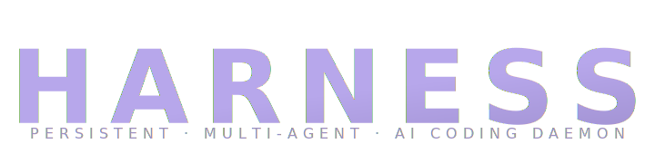

<p align="center">
  
</p>

<p align="center">
  A persistent, multi-agent AI coding daemon.
</p>

<p align="center">
  <a href="https://github.com/jbj338033/harness/actions/workflows/ci.yml"></a>
  <a href="https://github.com/jbj338033/harness/releases/latest"></a>
  <a href="LICENSE"></a>
</p>

---

Harness runs as a long-lived host process that serves clients (terminal, web, phone) over one JSON-RPC surface. Sessions outlive any single window — close the TUI, come back tomorrow from your phone, pick up mid-turn. Workers run in isolated git worktrees so the orchestrator spawns them in parallel without stepping on each other.

Provider-agnostic (Anthropic, OpenAI, Google, Ollama) with a first-class tool belt: content-hash file edits, sandboxed shell, web fetch, CDP browser, LSP, accessibility-aware screen control, and an MCP client for out-of-tree tools.

## Why this and not another agent

- **Persistent daemon.** The agent stays running. Reconnect from a different device and the in-flight turn is still there.
- **≥ 55% cost reduction** vs. running the same prompts cold each turn — Anthropic prompt caching is on by default for system + tools (1h TTL) and rolling on the last two messages (5m TTL). Real numbers depend on your traffic; we publish only the lower bound.
- **~10s median first-token latency** on the Anthropic streaming path with cache hot. Measured locally; we will not claim benchmark "SOTA" until external numbers land.
- **Offline-first verify loop.** Tests / lint / type-check first; LLM judge is opt-in (D-171a). The harness-owned regex pattern library means zero supply-chain dependency on third-party rule sets.
- **Agent UX over score chasing.** Same-action detector, trajectory alignment check, structured alert templates — failure modes are surfaced as deterministic UI, never as a model "I'm stuck" reply.

## Install

On the host machine (runs the daemon):

```sh
curl -sSL https://raw.githubusercontent.com/jbj338033/harness/main/install.sh | sh
```

Installs both binaries in `/usr/local/bin` and registers a launchd plist (macOS) or systemd unit (Linux).

On a client-only device (connects to a remote host):

```sh
curl -sSL https://raw.githubusercontent.com/jbj338033/harness/main/install.sh | sh -s -- --client-only
```

Installs the `harness` CLI only — no daemon, no service.

## Quick start

```sh
harness auth login          # pick a provider, paste a key or OAuth
harness                     # open the inline TUI
harness doctor              # end-to-end health check
```

Pair another device:

```sh
harness pair                                    # on the host
harness connect wss://<host>:8384 <code> <name> # on the new device
```

## Contributing

```sh
cargo fmt --all
cargo build --workspace
cargo test --workspace
cargo clippy --workspace --all-targets -- -D warnings
```

Keep changes focused, include a test, and match the house style in [`CLAUDE.md`](CLAUDE.md).

## Out of scope

To stay clear of EU AI Act Annex III "high-risk" classification, Harness is not designed for and is not authorised to be used as:

- Decisioning in employment, credit, or public-safety contexts.
- Biometric identification or categorisation.
- A "deep" companion / emotional-bond chatbot.

This is not legal advice. Operators deploying Harness in regulated jurisdictions must perform their own conformity assessment.

## License

MIT
